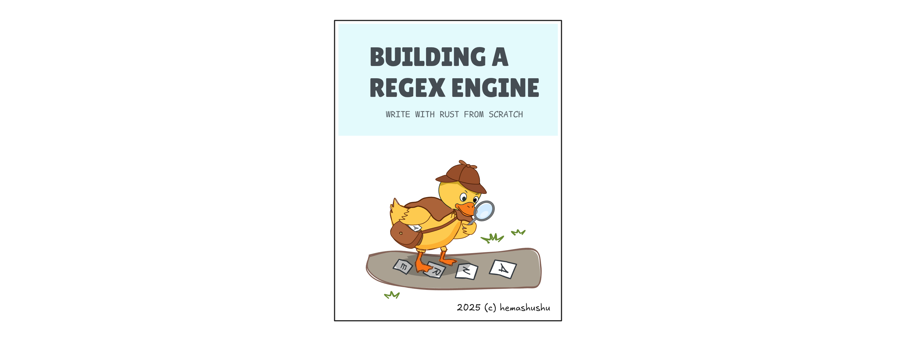

# Regex ANRE


[](https://crates.io/crates/regex-anre) [](https://docs.rs/regex-anre) [](https://github.com/hemashushu/regex-anre)

[Regex-anre](https://github.com/hemashushu/regex-anre) is a full-featured, zero-dependency regular expression engine that supports both standard and ANRE regular expressions.

Regex-anre provides the same API as the [Rust standard regular expression library "Rust-regex"](https://docs.rs/regex/), allowing it to be a drop-in replacement without any code changes.

<!-- @import "[TOC]" {cmd="toc" depthFrom=2 depthTo=4 orderedList=false} -->

<!-- code_chunk_output -->

- [1. Features](#1-features)
- [2. Quick Start](#2-quick-start)
  - [2.1 Find a specific pattern in a string](#21-find-a-specific-pattern-in-a-string)
  - [2.2 Match text and get each capture group](#22-match-text-and-get-each-capture-group)
  - [2.3 Validate a string](#23-validate-a-string)
- [3. Regular Expression Cheatsheet](#3-regular-expression-cheatsheet)
  - [3.1 Literals](#31-literals)
  - [3.2 Repetition](#32-repetition)
    - [3.2.1 Greedy quantifiers](#321-greedy-quantifiers)
    - [3.2.2 Lazy quantifiers](#322-lazy-quantifiers)
  - [3.3 Assertions](#33-assertions)
    - [3.3.1 Boundary Assertions](#331-boundary-assertions)
    - [3.3.2 Lookaround Assertions](#332-lookaround-assertions)
  - [3.4 Groups](#34-groups)
    - [3.4.1 Sequence](#341-sequence)
    - [3.4.2 Capture and Backreferences](#342-capture-and-backreferences)
  - [3.5 Logical Operators](#35-logical-operators)
- [4. The ANRE Language](#4-the-anre-language)
  - [4.1 Literals](#41-literals)
    - [4.1.1 Characters](#411-characters)
    - [4.1.2 Strings](#412-strings)
    - [4.1.3 Character Sets](#413-character-sets)
  - [4.2 Functions](#42-functions)
    - [4.2.1 Invocations](#421-invocations)
    - [4.2.2 Method-like Invocation](#422-method-like-invocation)
  - [4.3 Repetition](#43-repetition)
  - [4.4 Boundary Assertions](#44-boundary-assertions)
  - [4.5 Lookaround Assertions](#45-lookaround-assertions)
  - [4.6 Logical Operators](#46-logical-operators)
  - [4.7 Groups](#47-groups)
  - [4.8 Capture Groups and Backreferences](#48-capture-groups-and-backreferences)
    - [4.8.1 Capture Groups](#481-capture-groups)
    - [4.8.2 Backreferences](#482-backreferences)
  - [4.9 Separator and Multiline](#49-separator-and-multiline)
  - [4.10 Macros](#410-macros)
  - [4.11 Comments](#411-comments)
- [5. Examples](#5-examples)
  - [5.1 Matching Decimal Numbers](#51-matching-decimal-numbers)
  - [5.2 Matching Hexadecimal Numbers](#52-matching-hexadecimal-numbers)
  - [5.3 Email Address Validation](#53-email-address-validation)
  - [5.4 IPv4 Address Validation](#54-ipv4-address-validation)
  - [5.5 Matching Simple HTML Tags](#55-matching-simple-html-tags)
- [6. How the Regular Expression Engine Works](#6-how-the-regular-expression-engine-works)
  - [6.1 Why do we need to understand the engine?](#61-why-do-we-need-to-understand-the-engine)
  - [6.2 A simple language](#62-a-simple-language)
  - [6.3 The matching process](#63-the-matching-process)
  - [6.4 Transitions and Nodes](#64-transitions-and-nodes)
    - [6.4.1 Charset](#641-charset)
    - [6.4.2 Repetition](#642-repetition)
    - [6.4.3 Optional](#643-optional)
    - [6.4.4 Conjunction](#644-conjunction)
    - [6.4.5 Capture Groups](#645-capture-groups)
    - [6.4.6 Back-references](#646-back-references)
    - [6.4.7 Alternative Branches](#647-alternative-branches)
    - [6.4.9 Boundary Assertions](#649-boundary-assertions)
    - [6.4.10 Lookahead and Lookbehind Assertions](#6410-lookahead-and-lookbehind-assertions)
  - [6.5 Conclusion](#65-conclusion)
- [7 Linking](#7-linking)
- [8 License](#8-license)

<!-- /code_chunk_output -->

## 1. Features

- **Lightweight**: Regex-anre is built from scratch without any dependencies, making it extremely lightweight — its compiled binary is roughly one-tenth the size of the Rust-regex library.

- **Full-featured**: Regex-anre supports all general regular expression features, in addition to backreferences, look-ahead assertions, and look-behind assertions, which are not supported in the Rust-regex library.

- **Maintainable**: Regex-anre is designed to be easy to maintain, with a clean and modular code structure. The code is easy to read and understand, and most importantly, it is well-documented.

- **Reasonable performance**: Regex-anre is about 3 to 5 times slower than Rust-regex in text matching, but it is still reasonably fast. Moreover, Regex-anre compiles patterns far faster than Rust-regex, making it well-suited for dynamic pattern creation.

- **New language support**: ANRE is a functional language designed to be easy to read and write. It can be translated one-to-one into traditional regular expressions and vice versa. They can even be mixed together, reducing the cognitive overhead of writing complex regular expressions.

- **Compatibility**: Regex-anre provides the same API as the Rust-regex library, allowing you to directly replace the Rust-regex library in your project without any code changes.

## 2. Quick Start

Add the crate [regex_anre](https://crates.io/crates/regex-anre) to your project via the command line:

```bash
cargo add regex-anre
```

Alternatively, you can manually add it to your `Cargo.toml` file:

```toml
[dependencies]
regex-anre = "2.0.0"
```

The following demonstrates the three typical use cases of regular expressions.

### 2.1 Find a specific pattern in a string

```rust
use regex_anre::Regex;

// Using traditional regex to find hexadecimal color codes
let re = Regex::new(r"#[\da-fA-F]{6}").unwrap();

// Using ANRE
let re = Regex::from_anre("('#', [char_digit, 'a'..'f', 'A'..'F'].repeat(6))").unwrap();

let text = "The color is #ffbb33 and the background is #bbdd99.";

// Find one match
if let Some(m) = re.find(text) {
    println!("Found match: {}", m.as_str());
} else {
    println!("No match found");
}

// Find all matches
let matches: Vec<_> = re.find_iter(text).collect();
for m in matches {
    println!("Found match: {}", m.as_str());
}
```

### 2.2 Match text and get each capture group

```rust
use regex_anre::Regex;

// Using traditional regex to capture RGB components from hexadecimal color codes
let re =
    Regex::new(r"#(?<red>[\da-fA-F]{2})(?<green>[\da-fA-F]{2})(?<blue>[\da-fA-F]{2})").unwrap();

// Using ANRE
let re = Regex::from_anre(
    "
    /* ANRE supports comments, multiline and macro definitions,
     * which can make the regular expression more readable and maintainable.
     */

    (
        // Define a charset for hexadecimal digits with a macro `hex`
        define hex ([char_digit, 'a'..'f', 'A'..'F'])

        // Define a macro `two_hex` for two hexadecimal digits
        define two_hex hex.repeat(2)

        // Hexadecimal color code starts with a character `#`
        '#'

        // Capture groups for red, green, and blue components
        two_hex as red
        two_hex as green
        two_hex as blue
    )"
).unwrap();

let text = "The color is #ffbb33 and the background is #bbdd99.";

// Find one match and print capture groups
if let Some(m) = re.captures(text) {
    println!("Found match: {}", m.get(0).unwrap().as_str());
    println!("Red: {}", m.name("red").unwrap().as_str());
    println!("Green: {}", m.name("green").unwrap().as_str());
    println!("Blue: {}", m.name("blue").unwrap().as_str());
} else {
    println!("No match found");
}

// Find all matches and print capture groups
let matches: Vec<_> = re.captures_iter(text).collect();
for m in matches {
    println!("Found match: {}", m.get(0).unwrap().as_str());
    println!("Red: {}", m.name("red").unwrap().as_str());
    println!("Green: {}", m.name("green").unwrap().as_str());
    println!("Blue: {}", m.name("blue").unwrap().as_str());
}
```

### 2.3 Validate a string

```rust
use regex_anre::Regex;

// Using a traditional regex to validate a date string in the format `YYYY-MM-DD`
let re = Regex::new(r"^\d{4}-\d{2}-\d{2}$").unwrap();

// Using ANRE
let re = Regex::from_anre(
    "
    /* Validate a date string in the format `YYYY-MM-DD`
     * The `is_start()` and `is_end()` functions are string start and end assertions,
     * which ensure that the entire string matches the pattern.
     */

    (
        is_start()
        char_digit.repeat(4)
        '-'
        char_digit.repeat(2)
        '-'
        char_digit.repeat(2)
        is_end()
    )",
).unwrap();

println!("{}", re.is_match("2025-04-22")); // Expected: true
println!("{}", re.is_match("04-22")); // Expected: false
```

## 3. Regular Expression Cheatsheet

The following table summarizes the patterns of regular expressions and the corresponding ANRE expressions.

### 3.1 Literals

| Regex Pattern | ANRE Expression          | Description                                            |
|---------------|--------------------------|--------------------------------------------------------|
| `a`           | `'a'`                    | Match a single character                               |
| `abc`         | `"abc"`                  | Match a series of characters in order                  |
| `[abc]`       | `['a', 'b', 'c']`        | Match any character in the set                         |
| `[a-z]`       | `['a'..'z']`             | Match any character in the range                       |
| `[a-zA-Z]`    | `['a'..'z', 'A'..'Z']`   | Match any character in the combined ranges             |
| `[^abc]`      | `!['a', 'b', 'c']`       | Match any character not in the set                     |
| `\d`          | `char_digit`             | Match any digit character (0-9)                        |
| `\D`          | `char_not_digit`         | Match any non-digit character                          |
| `\w`          | `char_word`              | Match any word character (alphanumeric or underscore)  |
| `\W`          | `char_not_word`          | Match any non-word character                           |
| `\s`          | `char_space`             | Match any whitespace character (space, tab, newline)   |
| `\S`          | `char_not_space`         | Match any non-whitespace character                     |
| `[a-f\d]`     | `['a'..'f', char_digit]` | Match any character in the set (combine ranges and predefined character classes) |
| `.`           | `char_any`               | Match any character except newline                     |

### 3.2 Repetition

#### 3.2.1 Greedy quantifiers

| Regex Pattern | ANRE Expression           | Description                              |
|---------------|---------------------------|------------------------------------------|
| `a?`          | `'a'?`                    | Match zero or one occurrence of 'a'      |
| `a+`          | `'a'+`                    | Match one or more occurrences of 'a'     |
| `a*`          | `'a'*`                    | Match zero or more occurrences of 'a'    |
| `a{n}`        | `'a'{n}`                  | Match exactly n occurrences of 'a'       |
| `a{n,}`       | `'a'{n..}`                | Match at least n occurrences of 'a'      |
| `a{m,n}`      | `'a'{m..n}`               | Match between m and n occurrences of 'a' |

#### 3.2.2 Lazy quantifiers

Lazy quantifiers match as few characters as possible while still satisfying the condition. They are denoted by a `?` after the greedy quantifier. For example, `a??` will match zero or one occurrence of 'a', but it will prefer to match zero occurrences if possible.

| Regex Pattern | ANRE Expression           | Description                              |
|---------------|---------------------------|------------------------------------------|
| `a??`         | `'a'??`                   | Match zero or one occurrence of 'a'      |
| `a+?`         | `'a'+?`                   | Match one or more occurrences of 'a'     |
| `a*?`         | `'a'*?`                   | Match zero or more occurrences of 'a'    |
| `a{n}?`       | `'a'{n}?`                 | Identical to `'a'{n}`                    |
| `a{n,}?`      | `'a'{n..}?`               | Match at least n occurrences of 'a'      |
| `a{m,n}?`     | `'a'{m..n}?`              | Match between m and n occurrences of 'a' |

Note that there is no effect for `a{n}?` because it matches exactly n occurrences, so there is no room for laziness.

### 3.3 Assertions

#### 3.3.1 Boundary Assertions

| Regex Pattern  | ANRE Expression          | Description                         |
|----------------|--------------------------|-------------------------------------|
| `^`            | `is_start()`             | Match the start of the string       |
| `$`            | `is_end()`               | Match the end of the string         |
| `\b`           | `is_bound()`             | Match a word boundary               |
| `\B`           | `is_not_bound()`         | Match a non-word boundary           |

#### 3.3.2 Lookaround Assertions

| Regex Pattern  | ANRE Expression          | Description                         |
|----------------|--------------------------|-------------------------------------|
| `a(?=...)`     | `'a'.is_before(...)`     | Positive lookahead                  |
| `a(?!...)`     | `'a'.is_not_before(...)` | Negative lookahead                  |
| `(?<=...)a`    | `'a'.is_after(...)`      | Positive lookbehind                 |
| `(?<!...)a`    | `'a'.is_not_after(...)`  | Negative lookbehind                 |

### 3.4 Groups

#### 3.4.1 Sequence

| Regex Pattern  | ANRE Expression          | Description                         |
|----------------|--------------------------|-------------------------------------|
| `abc\d+`       | `("abc", char_digit+)`   | Sequence of patterns or expressions |
| `(?:abc\d+)`   | `("abc", char_digit+)`   | Non-capturing group                 |

#### 3.4.2 Capture and Backreferences

| Regex Pattern  | ANRE Expression          | Description                         |
|----------------|--------------------------|-------------------------------------|
| `(abc)`        | `#("abc")`               | Indexed capture group               |
| `\1`           | `^1`                     | Indexed backreference               |
| `(?<name>abc)` | `"abc" as name`          | Named capture group                 |
| `\k<name>`     | `name`                   | Named backreference                 |

### 3.5 Logical Operators

| Regex Pattern  | ANRE Expression                   | Description                |
|----------------|-----------------------------------|----------------------------|
| `a\|b`         | `'a' \|\| 'b'`                    | Logical OR (alternation)   |
| `(a\|b)c`      | `('a' \|\| 'b', 'c')`             | Sequence with alternation  |
| `abc\d+\|foo`  | `("abc", char_digit+) \|\| "foo"` | Alternation with sequences |

## 4. The ANRE Language

The ANRE language is a functional language designed to be easy to read and write. It can be translated one-to-one into traditional regular expressions and vice versa.

The ANRE language is quite simple, it is composed of literals, functions, group operator, a logical `OR` operator, and identifiers.

- Literals represent the basic building blocks of regular expressions, such as characters, strings, and character sets. They are all called _expressions_ in ANRE.
- Functions represent the operations that can be performed on expressions, such as repetition. They take one or more expressions and numbers as parameters and return a _new expression_. There are also some functions that have no parameters, such as boundary assertions.
- Group operators allow us to group expressions together to form more complex patterns. Note that the group operator is mandatory if there are more than one expression at the root level.
- Logical operators allow us to combine expressions using logical `OR`.
- Identifiers are used to define macros and capture groups. They can be used as expressions after they are defined.

### 4.1 Literals

Literals are the basic expressions in ANRE. They can be characters, strings, or character sets.

#### 4.1.1 Characters

A character literal is a single character that is matched exactly. Character literals are surrounded by single quotes. Character literals can be any Unicode character, including letters, digits, symbols, and even emojis.

For example:

- `'a'`
- `'文'`
- `'❤️'`

Character literals also support escape sequences, which allow us to represent special characters that cannot be typed directly. The following table lists the common escape sequences:

| Escape Sequence | Character         | Description     |
|-----------------|-------------------|-----------------|
| `\\`            | `\`               | Backslash       |
| `\'`            | `'`               | Single quote    |
| `\"`            | `"`               | Double quote    |
| `\n`            | Newline           | Line feed       |
| `\r`            | Carriage return   | Carriage return |
| `\t`            | Tab               | Horizontal tab  |
| `\0`            | Null character    | Null character  |
| `\u{X}`         | Unicode character | Unicode character with code point X |

Where `X` is hexadecimal digits `(0-9, a-f, A-F)` and the valid range for `X` is from `0` to `10FFFF`, excluding the surrogate range `D800` to `DFFF`.

#### 4.1.2 Strings

A string literal is a sequence of characters that is matched exactly. String literals are surrounded by double quotes. String literals can contain any characters, including escape sequences.

For example:

- `"hello world"`
- `"你好，世界！"`
- `"I ❤️ Rust!"`
- `"\u{6587}\u{5b57}"`

#### 4.1.3 Character Sets

A character set is a set of characters that can be matched. Character sets are represented as a list of characters and ranges surrounded by square brackets. A character set can contain individual characters, ranges of characters.

For example:

- `['a', 'b', 'c']`: matches any character that is 'a', 'b', or 'c'.
- `['a'..'z']`: matches any lowercase letter from 'a' to 'z'.
- `['0'..'9', 'a'..'z', '-']`: matches any digit, lowercase letter, or hyphen.

##### 4.1.3.1 Negated Character Sets

A negated character set matches any character that is not in the set. Negated character sets are represented by prefixing the character set with an exclamation mark `!`.

For example:

- `!['a', 'b', 'c']`: matches any character that is not 'a', 'b', or 'c'.
- `!['a'..'z']`: matches any character that is not a lowercase letter.
- `!['0'..'9', 'a'..'z', '-']`: matches any character that is not a digit, lowercase letter, or hyphen.

For a given source string `"abc123-xyz"`, the character set `['a'..'z']` will match the characters 'a', 'b', 'c', 'x', 'y', and 'z', while the negated character set `!['a'..'z']` will match the characters '1', '2', '3', and '-'.

##### 4.1.3.2 Nested Character Sets

Character sets can be nested to create more complex expressions.

The following demonstrates a nested character set:

```anre
[
    ['a'..'z', 'A'..'Z']
    ['0'..'9']
    ['+', '-', '_']
]
```

> ANRE expresses can be written in multiple lines, which can make the expressions more readable and maintainable.

This character set combines three character sets:

- one for letters (both lowercase and uppercase)
- one for digits
- one for punctuations.

It is equivalent to `['a'..'z', 'A'..'Z', '0'..'9', '+', '-', '_']` but is more readable and maintainable.

Note that negated character sets are not allowed to be nested, for example, `[!['0'..'9']]` is not valid expression.

##### 4.1.3.3 Predefined Character Classes

ANRE also provides some predefined character classes for common sets of characters. These character classes are represented as identifiers. The following table lists the predefined character classes:

| Character Class  | Description                                             |
|------------------|---------------------------------------------------------|
| `char_digit`     | Matches any digit character (0-9)                       |
| `char_not_digit` | Matches any non-digit character                         |
| `char_word`      | Matches any word character (alphanumeric or underscore) |
| `char_not_word`  | Matches any non-word character                          |
| `char_space`     | Matches any whitespace character (space, tab, newline)  |
| `char_not_space` | Matches any non-whitespace character                    |

Predefined character classes can be also included in character sets, for example:

`[char_word, '+', '-', '_']`

But negated predefined character classes are not allowed to be included in character sets, for example, `[!char_digit]` is not valid expression.

### 4.2 Functions

ANRE provides functions to represent repetition and assertion operations.

For example:

`repeat('a', 3)`

This is a function with name `repeat` that takes an expression (a character literal 'a') and a number 3 as parameters, this function represents exactly three occurrences of 'a', it is equivalent to the regex `a{3}`.

Typical function signature:

`function_name(expression, args...) -> expression`

Not all functions have parameters and return values, for example, `is_start()` is a function that takes no parameters and returns `void` that represents the start of the string, it is equivalent to the regex `^`.

#### 4.2.1 Invocations

Function invocation syntax:

`function_name(expression, args...)`

If a function returns an expression, and another function takes an expression as a parameter, we can nest the function invocations together to create more complex expressions.

For example:

`optional(repeat('a', 3))`

This is a function invocation where the `optional` function takes another function invocation `repeat('a', 3)` as its parameter. This expression represents zero or one occurrence of exactly three 'a's, it is equivalent to the regex `(a{3})?`.

#### 4.2.2 Method-like Invocation

ANRE also supports method-like invocation syntax, where a function can be invoked as a method on an expression. For example, `'a'.repeat(3)` is equivalent to `repeat('a', 3)`.

Method-like invocation syntax:

`expression.function_name(args...) -> expression`

Similar to nested invocations, method-like invocation can be chained together, for example, the following expressions are equivalent:

- `optional(repeat('a', 3))`
- `'a'.repeat(3).optional()`

Because method-like invocation is more concise and readable, it is recommended to use it when possible.

### 4.3 Repetition

Repetition allows us to match a pattern multiple times. As the previous section mentioned, ANRE provides functions to represent repetition, such as `repeat`, `repeat_from`, and `repeat_range`. Since these functions are commonly used, ANRE also provides notation forms for them, such as `*`, `+`, `?`, `{n}`, `{n..}`, and `{m..n}`.

The following table lists the repetition functions and their corresponding notation format:

| Function                  | Notation    | Description                                         |
|---------------------------|-------------|-----------------------------------------------------|
| `optional(exp)`           | `exp?`      | Match zero or one occurrence of the expression      |
| `one_or_more(exp)`        | `exp+`      | Match one or more occurrences of the expression     |
| `zero_or_more(exp)`       | `exp*`      | Match zero or more occurrences of the expression    |
| `repeat(exp, n)`          | `exp{n}`    | Match exactly n occurrences of the expression       |
| `repeat_from(exp, n)`     | `exp{n..}`  | Match at least n occurrences of the expression      |
| `repeat_range(exp, m, n)` | `exp{m..n}` | Match between m and n occurrences of the expression |

For example, for a given source string `"aa-aaa-aaaa"`:

- `"aa".repeat(2)` will match "aa" at index 0, 3, 7, and 9.
- `"aa".repeat_from(3)` will match "aaa" at index 3 and "aaaa" at index 7.
- `"aa".repeat_range(1, 3)` will match "aa" at index 0, "aaa" at index 3, and "aaa" at index 7

Since all repetition functions take an expression as the first parameter, and return a new expression, thus they support method-like chain invocation.

For example, `"abc".repeat(2).optional()` is equivalent to `optional(repeat("abc", 2))`

The repetition functions are greedy by default, which means they will match as many characters as possible while still satisfying the condition. For example, for a given source string `"aaaa"`, expression `'a'.repeat_from(1)` will match "aaaa" at index 0.

There are also lazy versions of the repetition functions, such as `lazy_optional` and `lazy_repeat_range`. They have the same parameters and return values as their greedy counterparts, but they match as few characters as possible while still satisfying the condition.

| Function                       | Notation     | Description                                         |
|--------------------------------|--------------|-----------------------------------------------------|
| `lazy_optional(exp)`           | `exp??`      | Match zero or one occurrence of the expression      |
| `lazy_one_or_more(exp)`        | `exp+?`      | Match one or more occurrences of the expression     |
| `lazy_zero_or_more(exp)`       | `exp*?`      | Match zero or more occurrences of the expression    |
| `lazy_repeat(exp, n)`          | `exp{n}?`    | Match exactly n occurrences of the expression       |
| `lazy_repeat_from(exp, n)`     | `exp{n..}?`  | Match at least n occurrences of the expression      |
| `lazy_repeat_range(exp, m, n)` | `exp{m..n}?` | Match between m and n occurrences of the expression |

For example, for a given source string `"aaaa"`, expression `'a'.lazy_repeat_from(1)` will match "a" at index 0, "a" at index 1, "a" at index 2, and "a" at index 3.

Note that the laziness of a fixed repetition has no effect, thus `lazy_repeat(exp, n)` is semantically equivalent to `repeat(exp, n)`, and they are both equivalent to the notation `exp{n}`.

### 4.4 Boundary Assertions

There are four boundary assertions in ANRE, which are represented as functions that take no parameters and return `void`. They are `is_start()`, `is_end()`, `is_bound()`, and `is_not_bound()`, which are equivalent to the regex assertions `^`, `$`, `\b`, and `\B` respectively.

| Assertion        | Description                         |
|------------------|-------------------------------------|
| `is_start()`     | Match the start of the string       |
| `is_end()`       | Match the end of the string         |
| `is_bound()`     | Match a word boundary               |
| `is_not_bound()` | Match a non-word boundary           |

Where "word boundary" means the position between a word character and a non-word character. For example, consider the string "ab  cd":

| Position | Left Character | Right Character | Is Word Boundary? |
|----------|----------------|-----------------|-------------------|
| 0        | None           | 'a'             | Yes               |
| 1        | 'a'            | 'b'             | No                |
| 2        | 'b'            | ' '             | Yes               |
| 3        | ' '            | ' '             | No                |
| 4        | ' '            | 'c'             | Yes               |
| 5        | 'c'            | 'd'             | No                |
| 6        | 'd'            | None            | Yes               |

In programming, the "position" is often represented by an "index", which is the number of characters from the start of the string. You can replace the "position" column with "index" column in the above table, and replace the "Left Character" and "Right Character" columns with "Previous Character" and "Current Character" columns, this may be more intuitive to understand the concept of word boundary.

In short, the function `is_bound()` only returns true when the current character is a word character (`\w`) and the previous character is a non-word character, or vice versa.

What is "assertion"?

"Assertion" is a type of operation in regular expressions that checks if a certain condition is true at a specific position in the source string, if the condition is true, the assertion is successful, the previous match is considered successful, otherwise it is a failure, and the previous match is discarded.

Note that there is a cursor at the source string during the matching process, matching operations (such as literal and repetition) will check character on the cursor and move the cursor forward one by one if the match is successful. For example, for a given source string `"abc 123"`, expression `char_word+` will match "abc" at index 0, and the cursor will move to position 3.

> Some documents may say "consume characters" instead of "move the cursor", but it is more accurate to say "move the cursor", because the characters are not actually consumed, they are still there in the source string, and can be matched again on backtracking.

On the other hand, "asserting" operations only check if the pattern matches at the current cursor position, they use their own cursor and keep the main cursor unchanged. For example, for a given source string `"abc 123"`, expression `(char_word+, is_bound())` will first match "abc" and move the cursor at position 3, and then take a look at the next character (' ' in this case), since it is a non-word character, thus there is a word boundary between 'c' and ' ', so the assertion is successful, during the "assertion" process, the main cursor always stay at position 3.

### 4.5 Lookaround Assertions

Lookaround assertions are a type of assertion that allows us to check if a pattern matches before or after the current cursor position without moving the cursor. There are four lookaround assertions in ANRE, which are represented as functions that take two expressions as parameters and return `void`.

| Assertion                         | Description         |
|-----------------------------------|---------------------|
| `is_before(exp, next_exp)`        | Positive lookahead  |
| `is_not_before(exp, next_exp)`    | Negative lookahead  |
| `is_after(exp, previous_exp)`     | Positive lookbehind |
| `is_not_after(exp, previous_exp)` | Negative lookbehind |

Example:

- `char_word+.is_before("ing")`: Matches a word followed by "ing", such as "playing" and "singing"
- `char_word+.is_not_before("ed")`: Matches a word not followed by "ed"
- `char_word+.is_after("pre")`: Matches a word preceded by "pre", such as "preheat" and "prefix"
- `char_word+.is_not_after("post")`: Matches a word not preceded by "post"

> The lookbehind assertions (`is_after` and `is_not_after`) only support fixed-length patterns. For example, `char_word+.is_after("pre")` is valid because "pre" is a fixed-length pattern, but `char_word+.is_after(char_word+)` is not valid because the assertion expression can match a variable number of characters.

Similar to the boundary assertions, lookaround assertions also do not move the cursor during the matching process. For example, for a given source string `"playing"`, expression `char_word+.is_before("ing")` will first match "play" at index 0 and move the cursor to position 4, and then take a look at the next characters "ing", since it matches, thus the assertion is successful, during the "assertion" process, the cursor always stay at position 4.

### 4.6 Logical Operators

There is only one binary operation in regular expressions, which is the logical `OR` operation, also known as alternation. In ANRE, it is represented by the `||` operator.

Syntax:

`expression1 || expression2 -> expression`

For example, the expression `"cat" || "dog"` will match either "cat" or "dog".

### 4.7 Groups

Groups are used to group multiple expressions together to form a single expression. Groups are represented by parentheses `()` and the expressions inside the parentheses are separated by commas `,` or whitespace.

Syntax:

`( expression1, expression2, ...) -> expression`

For example, `("abc", char_digit+)` is a group that matches the string literal "abc" followed by a repetition expression.

ANRE only allows one expression at the root level, thus if there are multiple expressions, they must be grouped together. For example, the following expression is not valid:

`is_start(), char_digit+, is_end()`

But we can group them together to make it valid:

`(is_start(), char_digit+, is_end())`

> ANRE groups are only used to join multiple expressions together, they are equivalent to non-capturing groups in traditional regular expressions. And the traditional regular expression does not require any operator to join expression sequences, for example, `("abc", char_digit+)` in ANRE can be simply written as `abc\d+`.

The second usage of groups is to change the precedence of operators, for example, if you want to match a number with suffix "UL" or a binary number with prefix "0b", the following expression will not work as expected:

`(char_digit+, "UL" || "0b", ['0', '1']+)`

This is because the `||` operator has higher precedence than the sequence operator `,`, thus the expression is parsed as:

`(char_digit+, ("UL" || "0b"), ['0', '1']+)`

The correct way to write this expression is to group the two kinds of numbers together:

`((char_digit+, "UL") || ("0b", ['0', '1']+))`

> The precedence of `OR` operators in traditional regular expressions is lower than the expression sequence, thus the above expression can be written without any parentheses as `\d+UL|0b[01]+`.

### 4.8 Capture Groups and Backreferences

Sometimes we want to not only match a pattern, but also want to get specific parts of the matched text, this is where capture groups come in.

#### 4.8.1 Capture Groups

In ANRE, we can capture a part of the matched text by preceding the expression with `#`.

Syntax:

`#expression`

For example, `(#char_word+, #char_digit+)` will match a word followed by a number, and capture the word and the number separately. For a given source string `"foo abc123 bar"`, this expression will match "abc123", and capture "abc" and "123" in two separate capture groups with indices 1 and 2 (the index 0 is reserved for the entire match).

Besides indexed capture groups, ANRE also supports named capture groups, which are defined by appending `as name` to the expression.

Syntax:

`expression as name`

Named capture groups can be accessed by both their name and their index, for example, `(char_word+ as word, char_digit+ as number)` will match a word followed by a number, and capture the word and the number in two separate capture groups with names "word" and "number", and indices 1 and 2 respectively.

> Named capture groups create indexed capture groups automatically, thus you are not necessary to precede the expression with `#`.

#### 4.8.2 Backreferences

Backreferences allow us to refer to previously captured groups in the same regular expression. In ANRE, backreferences are represented by the `^` operator followed by the index or name of the capture group.

Syntax:

- Index based: `^index`
- Name based: `name`

For example, `(#char_word+, '-', ^1)` or `(char_word+ as word, '-' , word)` will match a word followed by a hyphen and the same word again. such as "foo-foo" but not "foo-bar".

### 4.9 Separator and Multiline

In ANRE, commas `,` and whitespace (including newlines) can be used as separators to separate expressions in a group or in the function invocation arguments. For example, the following expressions are equivalent:

- `("abc", char_digit+)`
- `("abc" char_digit+)`

```anre
(
    "abc"
    char_digit+
)
```

Commas and whitespace are identical in semantics, thus you can choose either of them as you like. It is recommended to span expressions across multiple lines if they are long or complex, which can make the expression more readable and maintainable.

### 4.10 Macros

ANRE supports macros, which allow us to define reusable expressions. Macros are defined using the `define` keyword followed by the macro name and the expression surrounded by parentheses.

Syntax:

`define macro_name (expression)`

Example:

```anre
define hex_digit (['0'..'9', 'a'..'f', 'A'..'F'])
define component ('#', hex_digit.repeat(2))
(
    is_start()
    component as red
    component as green
    component as blue
    is_end()
)
```

The above expression defines a macro `hex_digit` for hexadecimal digits, and a macro `component` for a hexadecimal color component, and then uses these macros to define a regular expression that matches a hexadecimal color code in the format `#RRGGBB`, where `RR`, `GG`, and `BB` are two-digit hexadecimal numbers representing the red, green, and blue components of the color respectively.

### 4.11 Comments

ANRE supports comments, which can be added using `/* */` for block comments or `//` for line comments. Comments can be placed anywhere in the expression and will be ignored by the regular expression engine. For example:

```anre
(
    /* This is a block comment */
    "abc" // This is a line comment
    char_digit+
)
```

Block comments can even be nested, for example:

```anre
(
    /*
        This is a block comment
        /* This is a nested block comment */
    */
    "abc"
    char_digit+
)
```

Nested block comments can be useful when you want to temporarily comment out a part of the expression that already contains comments.

## 5. Examples

This section provides some examples of how to use the ANRE language to write regular expressions for common use cases.

### 5.1 Matching Decimal Numbers

```anre
/**
 * Decimal Numbers Regular Expression
 *
 * Examples:
 *
 * - "0"
 * - "123"
 */

char_digit.one_or_more()
```

### 5.2 Matching Hexadecimal Numbers

```anre
/**
 * Hex Numbers Regular Expression
 *
 * Examples:
 *
 * - "0x0"
 * - "0x123"
 * - "0xabc"
 * - "0xDEADBEEF"
 */

(
    // The prefix "0x"
    "0x"

    // The hex digits
    ['0'..'9', 'a'..'f', 'A'..'F'].one_or_more()
)
```

### 5.3 Email Address Validation

```anre
/**
 * Email Address Validation Regular Expression
 *
 * Examples:
 *
 * - "abc@example.domain"
 * - "john-smith.new+mailbox-department@example.com"
 *
 * Ref:
 * https://en.wikipedia.org/wiki/Email_address
 */

(
    // Asserts that the current is the first character
    is_start()

    // User name
    [char_word, '.', '-'].one_or_more()

    // Sub-address
    ('+', [char_word, '-'].one_or_more()).optional()

    // The separator
    '@'

    // Domain name
    (
        ['a'..'z', 'A'..'Z', '0'..'9', '-'].one_or_more()
        '.'
    ).one_or_more()

    // Top-level domain
    ['a'..'z'].repeat_from(2)

    // Asserts that the current is the last character
    is_end()
)
```

### 5.4 IPv4 Address Validation

```anre
/**
 * IPv4 Address Validation Regular Expression
 */

define num_25x ("25", ['0'..'5'])
define num_2xx ('2', ['0'..'4'], char_digit)
define num_1xx ('1', char_digit, char_digit)
define num_xx (['1'..'9'], char_digit)
define num_x (char_digit)
define part (num_25x || num_2xx || num_1xx || num_xx || num_x)

(is_start(), (part, '.').repeat(3), part, is_end())
```

### 5.5 Matching Simple HTML Tags

```anre
/**
 * Simple HTML Tag Regular Expression
 */

(
    '<'                                         // opening tag
    char_word+ as tag_name                      // tag name
    (                                           // attributes
        char_space,
        char_word+,                             // key
        ('=', '"', char_word+, '"').optional()  // value
    )*
    '>'
    char_any+?                                  // text content
    '<', '/', tag_name, '>'                     // closing tag
)
```

## 6. How the Regular Expression Engine Works


In this section, I will discuss how the regular expression engine works. It covers the core functions of the engine, including matching, capturing, back-references, and backtracking. I will avoid introducing complex algorithms (like NFA and DFA).

I hope this article is unique in that it explains the regular expression engine in a way that is easy to understand for everyone, and comprehensive in that it covers all the important details of the engine.

### 6.1 Why do we need to understand the engine?

In the general impression of developers, regular expressions are used for validating, searching strings. The regular expression text is somewhat like random characters which are typed by a cat rolling on the keyboard. You may prefer searching for regular expressions on the internet and then copy and paste those cryptic strings into your code. Sometimes these expressions do not work; sometimes they work, but you do not know why.

Regular expressions are hard to master for two reasons: one is that they are designed concisely and compactly, and the other — more importantly — is that few people explain how they work. Most resources only tell you how to use them, similar to a teacher who teaches you only the syntax of C but never explains how a program actually runs on the computer.

You only know the regular expression when you can build it.

### 6.2 A simple language

The regular expression is a simple language that is a combination of literals, repetitions, groups, and alternative branches. It lacks some important features of a general-purpose programming language, such as variables, conditional branches, and loops. Its sole purpose is to describe what the expected characters look like — or more accurately, to guide the processor on how to match characters in the source string.

> In short, regular expressions are used to match and capture characters

Yes, it is not about strings, but about characters. This distinction is important because it is the foundation for understanding regular expressions and how the engine works.

### 6.3 The matching process

Let's start with the simplified matching process. The simplest regular expression is just a character literal. For example, the regex `a` will match the character 'a' in a string.

Consider these examples:

- For a given string "abc", the processor will check the first character 'a', and since it is what the processor is looking for, it will mark the position (index 0 in this case) and end the process with success.

```diagram
abc
^
|-- the processor is looking for 'a', and it is found at index 0
```

The processor will return a tuple `(start, end)`, which are the start and end positions of the matched characters. In this case, it will return `(0, 1)`, which means the character 'a' is found at index 0 and ends at index 1 (the end position is exclusive).

- For a given string "cat", the processor will check the first character 'c', and since it is not what the processor is looking for, it will discard the matched characters (which is nothing in this case) and end the process with failure.

```diagram
cat
^
|-- the processor is looking for 'a', but it is not found at index 0
```

But the processor would not stop its job, it restart the matching process starts from the position next to the last start position (which is index 1 in this case) and find the character 'a'.

```diagram
cat
 ^
 |-- the processor is looking for 'a', and it is found at index 1
```

Character 'a' is what the processor is looking for, it will mark the position (index 1 in this case) and end the process with success. Finally, the processor returns `(1, 2)`.

- For a given string "dog", the processor will check each character one by one.

```diagram
dog
^
|-- the processor is looking for 'a', but it is not found at index 0
```

Since none of them is what the processor is looking for, it end the process with failure and returns `null`.

```diagram
dog
  ^
  |-- the processor is looking for 'a', but it is not found at index 2
```

You may have notice that there is a "cursor" in the above diagrams, which is the position of the processor the currently checking. Actually, the processor has a context object, which contains some information the processor needs during matching process. One of them is a tuple:

```diagram
(range_start, range_end, cursor)
```

The `range_start` and `range_end` positions are the checking range of source string. Usually, the `range_start` position is 0 and the `range_end` position is the length of the string, but in some cases (such as lookahead and lookbehind assertions, which will be covered in the next section), the `range_start` and `range_end` positions can be different.

The `cursor` is the position the processor is currently checking, as demonstrated in the above examples. When a new matching process starts, the `cursor` is set to the `range_start` position, and it keeps moving forward as the processor checks each character. When matching fails, the processor pulls the `cursor` back to the position just after the last start position and repeats the process. When the `cursor` start position reaches the `range_end` position, it indicates that the whole process has ended with failure.

It is worth mentioning that some regular expression engines also provide functions like `find_all` or `match_all` to find all occurrences of a character in the string. The principle is quite simple: the engine repeats the matching process starting from the position just after the last successful match. For example, for a given string "banana", the engine will ultimately return `[(1, 2), (3, 4), (5, 6)]`, which contains three matches. However, this is a function of the engine, not the processor. In this article, we focus only on how the processor works.

> A processor performs the matching job only once on the source string, but the engine may launch the processor multiple times (with different `cursor` start positions) to find all matches.

Now, let's look at a bit more complex example, to match strings. For example, the regex `abc` expects to match the string "abc" in the source string.

To the engine, strings are simply treated as a sequence of characters. The processor tries to match each character in the sequence one by one; if all characters are found in the source string, the processor marks the start and end positions and ends the process with success.

Consider these examples:

- For a given string "abcde", the processor set the cursor to the beginning of the string (index 0) and expect character 'a'.

```diagram
abcde
^
|-- the processor is looking for 'a', and it is found at index 0
```

It found 'a' at index 0 is what it is looking for, so it mark the start position (index 0) and moves the cursor to the next position (index 1) and expects character 'b'.

```diagram
|-- the matched characters start position, index 0
v
abcde
 ^
 |-- the processor is looking for 'b', and it is found at index 1
```

This process continues and the last expected character 'c' is found at index 2. Now, all expected characters are found, and the processor marks the end position (index 3) and end the process with success and returns `(0, 3)`.

```diagram
|-- the matched characters start position, index 0
v
abcde
  ^
  |-- the processor is looking for 'c', and it is found at index 2
```

- For a given string "about", the processor finds the expected characters 'a' and 'b' at index 0 and index 1 respectively, but when it tries to find 'c', it finds 'o' at index 2, which is not what it is looking for. So the processor discards the matched characters ("ab" in this case) and ends the current attempt with failure.

```diagram
|-- the matched characters start position, index 0
v
about
  ^
  |-- the processor is looking for 'c', but it is not found at index 2
```

The processor does not stop immediately; it keeps advancing the cursor's start position and trying to find the "a-b-c" sequence until the cursor's start position reaches the end of the string. Since no match is found, it ends the process with failure and returns `null`.

In summary, the matching process is a bit similar to the simplest String-searching algorithm - the [naive string search](https://en.wikipedia.org/wiki/String-searching_algorithm#Naive_string_search). The complete process is:

- The processor confirm the checking range of the source string, and set the cursor to the beginning of the checking range.
- It check the character the cursor is pointing to, if it is what it is looking for, it will mark the position and move on to the next character it needed until it finds all expected characters. If all expected characters are found, the processor will mark the end position and end the process with success and return `(start_position, end_position)`.
- If any character does not match during the process, the processor discards the matched characters (if any) and ends the current attempt with failure. It then pulls the cursor back to the position just after the last start position and repeats the matching process. If the cursor's start position reaches the end of the string, the whole process ends with failure and the processor returns `null`.

### 6.4 Transitions and Nodes

After reading the previous section, you might be wondering whether there is a second cursor pointing to the current expected character in the regular expression. There is no such cursor. Since regular expressions are a "language", not "data", they are intended to be compiled into code and run as a program.

> A complete regular expression engine consists of two parts: the compiler and the processor. The compiler parses the regular expression and generates code (which can be native machine instructions, bytecode, or a special data structure, depending on the implementation) that is then executed by the processor.

From a programming perspective, regular expression programs are built from two structures: nodes and transitions.

Transitions are the paths between nodes. There are many kinds of transitions, such as character transitions, charset transitions, and repetition transitions. Most transitions resemble a function in a programming language that contains a single `if` statement, which checks the current state and determines whether it passes or not.

The pseudo code of a typical transition template is like this:

```diagram
struct Transition {
    next_node: Node,
}

impl Transition {
    fn run(context) -> bool {
        if condition is met {
            let new_context = ...;
            return next_node.run(new_context);
        }else {
            return false;
        }
    }
}
```

For example, the single character regex `a` can be compiled into a transition:

```diagram
fn run(context) -> bool {
    let current_char = context.get_current_char();
    if current_char == 'a' {
        let new_context = context.move_cursor_forward(1);
        return next_node.run(new_context);
    }else {
        return false;
    }
}
```

Transitions are generated by the compiler; code such as `if current_char == 'a'` is hard-coded. When the regular expression becomes complex, many transitions are generated.

Nodes are containers of transitions; each node holds a list of transitions. The pseudo code of a typical node is like this:

```diagram
struct Node {
    transitions: Vec<Transition>,
}

impl Node {
    fn run(context) -> bool {
        for transition in self.transitions {
            if transition.run(context) {
                return true
            }
        }
        return false
    }
}
```

The following diagram shows how the nodes and transitions are connected:

```diagram
  /-----------------------------\
  |          character          |
  |        | transition         |
  |        v                    |
=====o==-------------------==o=====
  | in node            out node |
  |                             |
  \---- character component ----/
```

We then wrap the pair of nodes (`in node` and `out node`) and the transitions into a component, which is the basic unit of the program.

> Each component has an `in node` and an `out node`; these form the interface of the component.

Components can be nested, for example, the regex `ab` can be compiled into two character components, and the two components are connected by a special transition called `jump` transition. All of them form a new component - string component. The following diagram represents the structure of string component:

```diagram
  /-----------------------------------------------\
  |                                               |
  |    character                     character    |
  |    component        jump         component    |
  |  /-----------\   transition    /-----------\  |
=====o in    out o==-------------==o in    out o=====
  |  \-----------/                 \-----------/  |
  |                                               |
  \--------------- string component --------------/
```

> Some implementations may optimize the sequence of characters into one new kind of transition, which is called string transition.

The `jump` transition is used to connect the two components, there is no checking inside this transition, it just guides the processor to jump to the next node without moving the cursor. The pseudo code of the `jump` transition is like this:

```diagram
fn run(context) -> bool {
    return next_node.run(context);
}
```

Components are the building blocks of the program, they can be simple (like the character component) or complex (like the repeatition component the next section talks about, which contains multiple transitions, nodes, and inner components). The compiler generates components for each part of the regular expression, and then connects them together to form the complete program.

Where is the entry point of the program? In general, the `in node` of the top-most component is the entry. When a new matching process starts, the processor runs the `run` function of the entry node and keeps running the program until it reaches the exit node, which is the `out node` of the top-most component. Reaching the exit node means the process succeeded.

The exit node is special, its transition list is empty, and the pseudo code is like this:

```diagram
fn run(context) -> bool {
    return true
}
```

In summary, when a regular expression program is executed, the following process is performed:

- The processor invokes the function `run` from the entry node.
- The node calls each transition in its list:
  - If a transition is passed, the transition call the function `run` of its next node.
  - If a transition is not passed, the node tries the next transition in its list.
  - If any of the transitions returns true, the node return true without trying the rest of the transitions.
  - If all transitions are tried and none of them is passed, the node returns false.
- If the current node is the exit node, it returns true directly.
- If the entry node returns true, it means the process is successful, otherwise, it means the process is failed.

This is how the processor works. I have introduced the basic components and transitions — the character component, the string component, the character transition, and the jump transition. In the following sections, I will introduce more complex components and transitions.

#### 6.4.1 Charset

The charset component is used to match a character against a set of characters. A charset component contains a single charset transition, which holds a set of characters and checks whether the current character is in that set. For example, the regex `[abc]` is compiled into a charset transition with the character set `['a', 'b', 'c']`. The pseudo code of this charset transition is like this:

```diagram
fn run(context) -> bool {
    let current_char = context.get_current_char();
    if ['a', 'b', 'c'].contains(current_char) {
        let new_context = context.move_cursor_forward(1);
        return next_node.run(new_context);
    }else {
        return false;
    }
}
```

Charset transitions can also contain character ranges. For example, the pseudo code of the transition for the regex `[a-z0-9-]` is like this:

```diagram
fn run(context) -> bool {
    let current_char = context.get_current_char();
    if ('a'..='z').contains(&current_char) ||
        ('0'..='9').contains(&current_char) ||
        current_char == '-' {
        let new_context = context.move_cursor_forward(1);
        return next_node.run(new_context);
    }else {
        return false;
    }
}
```

The structure of the charset component is:

```diagram
  /-----------------------------\
  |          charset            |
  |        | transition         |
  |        v                    |
=====o==-------------------==o=====
  | in node            out node |
  |                             |
  \------ charset component ----/
```

#### 6.4.2 Repetition

The repetition component is used to match an inner component a certain number of times, such as `a{2}`, `a{2,}`, and `a{2,5}`. A repetition component consists of 5 transitions and 4 nodes, and its structure is:

```diagram
  /-------------------------------------------------------------------------\
  |                                                                         |
  |                      repetition back transition                         |
  |              /--------------------------------------------\             |
  |              |                                            |             |
  |              |     | counter             | counter        |             |
  |              |     | save                | load & inc     |             |
  |              |     | transition          | transition     |             |
  |  in          |     |                     |                |             |
  |  node        v     v     /-----------\   v  right node    |       out   |
=====o==-------==o==-------==o in    out o==------==o|o==-----/       node  |
  |          ^   left        \-----------/           |o==--------------==o=====
  |  counter |   node       inner component                   ^             |
  |  reset   |                                                | repetition  |
  |  transition                                               | forward     |
  |                                                           | transition  |
  |                                                                         |
  \--------------------- greedy repetition component -----------------------/
```

- `in node` and `out node`: they are the interface of the component.
- `left node` and `right node`: they are used internally to connect the inner component and the repetition transitions.
- `counter reset transition`: each repetition component has a counter, which is used to count how many times the inner component is matched. The counter reset transition is used to reset the counter to 0 before the loop starts.
- `counter save transition`: this transition is used to save the current counter value to a "counter stack" before the inner component is executed, this transition is needed because the inner component may contain other repetition components, which may modify the outer counter value, so we need to save the current counter value before executing the inner component, and restore it after the inner component is executed.
- `counter load and increment transition`: this transition is used to load the counter value from the "counter stack", and increment the counter by 1, then to prepare for the checking transitions:
  - `repetition back transition`: this transition is used to check the current counter value, if it is less than the maximum repetition times, it will jump back to the `left node` to execute the inner component again, otherwise, it will return false and the `repetition forward transition` will be tried.
  - `repetition forward transition`: this transition is used to check the current counter value also, if it is greater than or equal to the minimum repetition times, it will jump to the `out node`, otherwise, the repetition component returns false.

As described above, the repetition component executes the inner component as many times as possible until the counter reaches the maximum repetition count — hence the name greedy repetition. For example, the regex `a{2,4}` is compiled into a repetition component whose inner component is the character 'a', with a minimum of 2 and a maximum of 4 repetitions; it prefers to match 4 'a' characters whenever possible.

There is another kind of repetition component called lazy repetition, such as `a{2,5}?`, which is similar to greedy repetition but prefers to match as few times as possible. The structure of the lazy repetition component is almost identical to the greedy one, except that the order of the checking transitions is reversed:

```diagram
  /-------------------------------------------------------------------------\
  |                                                                         |
  |                    | counter             | counter                      |
  |                    | save                | load & inc                   |
  |                    | transition          | transition                   |
  |  in        left    |                     |                        out   |
  |  node      node    v     /-----------\   v  right node            node  |
=====o==-------==o==-------==o in    out o==------==o|o==--------------==o=====
  |          ^   ^           \-----------/           |o==--\  ^             |
  |  counter |   |          inner component                |  | repetition  |
  |  reset   |   |                                         |  | forward     |
  |  transition  \-----------------------------------------/  | transition  |
  |                      repetition back transition                         |
  |                                                                         |
  \--------------------- lazy repetition component -------------------------/
```

As shown in the diagram above, the `repetition forward transition` in the `right node` is tried before the `repetition back transition`. As a result, the component jumps to the `out node` as soon as the counter reaches the minimum repetition count, matching as few times as possible.

#### 6.4.3 Optional

The optional component is used to match an inner component 0 or 1 time, such as `a?`. The structure of the optional component is:

```diagram
  /-----------------------------------------------------\
  |                                                     |
  |              jump |       inner       | jump        |
  |  in    transition |     component     | transition  |
  |  node             v   /-----------\   v             |
=====o|o==--------------==o in    out o==----------==o=====
  |   |o==--\             \-----------/          out ^  |
  |         |                                   node |  |
  |         \----------------------------------------/  |
  |                       jump transition               |
  |                                                     |
  \--------------- greedy optional component -----------/
```

There are two jump transitions in the `in node`: one jumps to the `inner component`, and the other jumps directly to the `out node`. It prefers to match the inner component when possible, which is why it is called greedy optional. For example, the regex `a?` is compiled into an optional component whose inner component is the character 'a', and it prefers to match 'a' whenever possible.

There is another kind of optional component called lazy optional, such as `a??`, which is similar to the greedy optional but prefers to skip the inner component whenever possible. The structure of the lazy optional component is:

```diagram
  /-----------------------------------------------------\
  |                       jump transition               |
  |         /----------------------------------------\  |
  |  in     |                            jump        |  |
  |  node   |                          | transition  |  |
=====o|o==--/         /-----------\    v             v  |
  |   |o==----------==o in    out o==--------------==o=====
  |               ^   \-----------/                out  |
  |          jump |       inner                   node  |
  |    transition |     component                       |
  |                                                     |
  \---------------- lazy optional component ------------/
```

Combined with the repetition component, these components can be used to match an inner component zero or more times, such as `a*` and `a{0,5}`.

#### 6.4.4 Conjunction

In general, a regular expression is a sequence of components. For example, `0x[0-9a-fA-F]+` is a regex that matches a hexadecimal number. It contains two components: the string component `0x` and the repetition component `[0-9a-fA-F]+`. The processor executes the components one by one.

The compiler wraps the sequence of components into a "group component", where all components are connected by jump transitions:

```diagram
  /-------------------------------------------------------------\
  |                    jump                  other components   |
  |                  | transition          | and transitions    |
  |                  |                     |                    |
  |  /-----------\   |     /-----------\   |     /-----------\  |
=====o in    out o==-----==o in    out o==.....==o in    out o=====
  |  \-----------/         \-----------/         \-----------/  |
  |    component             component             component    |
  |                                                             |
  \----------------------- group component ---------------------/
```

When any inner component returns false, the group component returns false immediately without trying the remaining components. Only when all inner components pass does the group component return true.

#### 6.4.5 Capture Groups

It is worth mentioning that the processor can not only match and return the `(start, end)` position of the entire matched characters, but also supports extracting the parts of the matched characters you are interested in — this is called capture groups. For example, the regex `(\d{4})-(\d{2})-(\d{2})` matches a date string like "2026-06-23" and contains three capture groups used to extract the year, month, and day from the matched string. And the processor will return a list of tuple:

```diagram
[
    (0, 10),    // the whole matched string "2026-06-23"
    (0, 4),     // the first capture group "2026"
    (5, 7),     // the second capture group "06"
    (8, 10),    // the third capture group "23"
]
```

In practice, the processor always returns a list of tuples even when there are no capture groups in the regex; the first tuple is always the position of the overall matched result.

> If an engine supports functions like `find_all` or `match_all` to find all matches in the source string, the engine returns a list of lists of tuples.

To support capture groups, the processor's context object holds "capture group slots" — a list of tuples, where each tuple stores the start and end position of a capture group. The processor updates these slots when it executes a capture group component, and the final result is read from these slots.

The structure of the capture group component is:

```diagram
  /-------------------------------------------------\
  |                                                 |
  |  capture start                   capture end    |
  |  transition          inner       transition     |
  |       |            component       |            |
  |       v         /-------------\    V            |
=====o==----------==o in      out o==----------==o=====
  | in              \-------------/            out  |
  | node                                      node  |
  |                                                 |
  \---------------- capture component---------------/
```

Each capture group component has a group index and an optional name. The `capture start transition` marks the start position of the capture group, and the `capture end transition` marks the end position. The processor updates the "capture group slots" when it runs these two transitions.

In general, the compiler generates a capture group component for the whole regex, thus the first capture group slot is used to store the position of the overall matched characters. The structure of program component is:

```diagram
  /---------------------------------------------------------\
  |                                                         |
  |  capture start |                     capture end |      |
  |     transition |                      transition |      |
  |                V    /-------------\              v      |
=====o==-------------===o in      out o===-------------==o=====
  |  in                 \-------------/                 out |
  |  node               root expression                node |
  |                        component                        |
  |                                                         |
  \------------------- program component--------------------/
```

#### 6.4.6 Back-references

Back-references are used to match the same characters as a previously matched capture group. For example, the regex `(\w+)-\1` matches a string containing two identical words separated by a hyphen, such as "hello-hello". Here `\1` is a back-reference to the first capture group, meaning it matches the same characters that the first capture group captured.

The structure of the back-reference component is:

```diagram
  /-----------------------------\
  |          back-reference     |
  |        | transition         |
  |        v                    |
=====o==-------------------==o=====
  | in node            out node |
  |                             |
  \-- back-reference component -/
```

The back-reference transition read the specified capture group slot to get the start and end position of the previously matched characters, then it checks if the current characters in the source string are the same as the previously matched characters. The pseudo code of the back-reference transition is like this:

```diagram
fn run(context) -> bool {
    let (start, end) = context.get_capture_group_slot(group_index);
    let length = end - start;
    let current_substring = context.get_current_substring(length);
    let previous_substring = context.get_source_substring(start, end);
    if current_substring == previous_substring {
        let new_context = context.move_cursor_forward(length);
        return next_node.run(new_context);
    }else {
        return false;
    }
}
```

#### 6.4.7 Alternative Branches

There is only one type of branch in regular expressions: the alternative branch (i.e., the logical OR operator), such as `a|b`, which matches either 'a' or 'b'. The structure of the alternative branch component is:

```diagram
  /-------------------------------------------------------\
  |                                                       |
  |            jump         left          jump            |
  |      transition |     component     | transition      |
  |                 v   /-----------\   v                 |
  |  in     /---------==o in    out o==--------\      out |
  |  node   |           \-----------/          |     node |
=====o|o==--/                                  |-----==o=====
  |   |o==--\                                  |          |
  |         |           /-----------\          |          |
  |         \---------==o in    out o==--------/          |
  |                 ^   \-----------/   ^                 |
  |            jump |      right        | jump            |
  |      transition |    component      | transition      |
  |                                                       |
  \------------ alternative branch component -------------/
```

There are two jump transitions in the `in node`: one jumps to the `left component`, and the other jumps to the `right component`. Both jump to the `out node` if they succeed, so as long as one of the components matches, the entire alternative branch matches.

#### 6.4.9 Boundary Assertions

There are 4 types of boundary assertions in regular expressions: `^`, `$`, `\b`, and `\B`.

- `^`: matches the beginning of the string. The beginning boundary assertion transition checks whether the cursor equals the start position of the checking range.
- `$`: matches the ending of the string. The ending boundary assertion transition checks whether the cursor equals the end position of the checking range.
- `\b`: matches a word boundary. The word boundary assertion transition checks whether the current position is a word boundary — that is, the current character is a word character (alphanumeric or underscore) and the previous character is not, or vice versa.
- `\B`: matches a non-word boundary. The non-word boundary assertion transition simply inverts the result of the word boundary assertion transition.

The following diagram shows an example string with the positions where the boundary assertions return true:

```diagram
 |-- beginning boundary == true
 |
 |            |-- ending boundary == true
 V            v
"....abcde...."
     ^    ^
     |    |-- word boundary == true
     |
     |-- word boundary == true
```

There are only two positions in the string where the word boundary assertion returns true: one is character 'a', and the other is the position after character 'e'. For more details about word boundaries, you can refer to the documentation of [JavaScript regular expressions](https://developer.mozilla.org/en-US/docs/Web/JavaScript/Reference/Regular_expressions/Word_boundary_assertion).

The structure of these boundary assertion components are the same:

```diagram
  /-----------------------------\
  |          boundary assertion |
  |        | transition         |
  |        v                    |
=====o==-------------------==o=====
  | in node            out node |
  |                             |
  \--- bound assert component --/
```

Unlike other components, the boundary assertion component does not advance the cursor. It only peeks at the source string and returns true or false.

#### 6.4.10 Lookahead and Lookbehind Assertions

Lookahead and lookbehind assertions check whether a certain pattern is followed or preceded by another pattern, without including that surrounding pattern in the matched result.

For example, the lookahead assertion `\w+(?=ing)` matches a word only if it is followed by 'ing', as in "playing" or "singing". The lookbehind assertion `(?<=pre)\w+` matches a word only if it is preceded by 'pre', as in "prefix" or "prelude".

There are also negative variants: `\w+(?!ing)` matches a word only if it is not followed by 'ing', and `(?<!pre)\w+` matches a word only if it is not preceded by 'pre'.

The structure of the look-ahead assertion component is:

```diagram
  /----------------------------------------------\
  |                                              |
  |                  inner         | lookahead   |
  |  in             component      | transition  |
  |  node         /-----------\    v             |
=====o==--------==o in  out   o==-----------==o=====
  |       jump    \-----------/             out  |
  |    transition                          node  |
  |                                              |
  \------------- lookahead assertion component --/
```

And the structure of the look-behind assertion component is:

```diagram
  /-----------------------------------------------\
  |                                               |
  |       | lookbehind                            |
  |  in   | transition                jump        |
  |  node v           /-----------\   transition  |
=====o==------------==o in  out   o==--------==o=====
  |                   \-----------/          out  |
  |                  inner component        node  |
  |                                               |
  \-------- lookbehind assertion component -------/
```

Look-around assertions are sub-programs within the regular expression program. They have their own entry and exit nodes and are executed with new context objects; only the checking range of the context object differs:

- For a lookahead assertion, the start of the checking range is the current cursor position, and the end is the same as in the original context.
- For a lookbehind assertion, the end of the checking range is the current cursor position, and the start is calculated from the maximum length of the lookbehind pattern. For example, for `(?<=pre)\w+`, the pattern "pre" has a maximum length of 3, so the start is the current cursor position minus 3. Variable-length lookbehind assertions are not supported in most regular expression engines.

The look-around assertion component returns true if the inner component matches successfully, and false otherwise.

When the sub-program end, the main program continues to execute the look-around assertion component with the return value from the sub-program.

### 6.5 Conclusion

If you are interested in how the regular expression engine works, and how to implement a comprehensive engine, you can read the source code of this crate, which is well documented and organized.



You can also read my book [Building a Regex Engine - Implementing a Comprehensive Regular Expression Engine with Rust](https://leanpub.com/building-a-regex-engine), which provides a viewpoint of how regular expression engines work, and gives a step-by-step guide to building a regular expression engine from scratch in Rust, covering all the features mentioned in this crate and more.

## 7 Linking

- [Regex ANRE source code repository](https://github.com/hemashushu/anre)
- [Book: Building a Regex Engine](https://leanpub.com/building-a-regex-engine)

## 8 License

This project is licensed under the MPL 2.0 License with additional terms. See the files [LICENSE](./LICENSE) and [LICENSE.additional](./LICENSE.additional)
