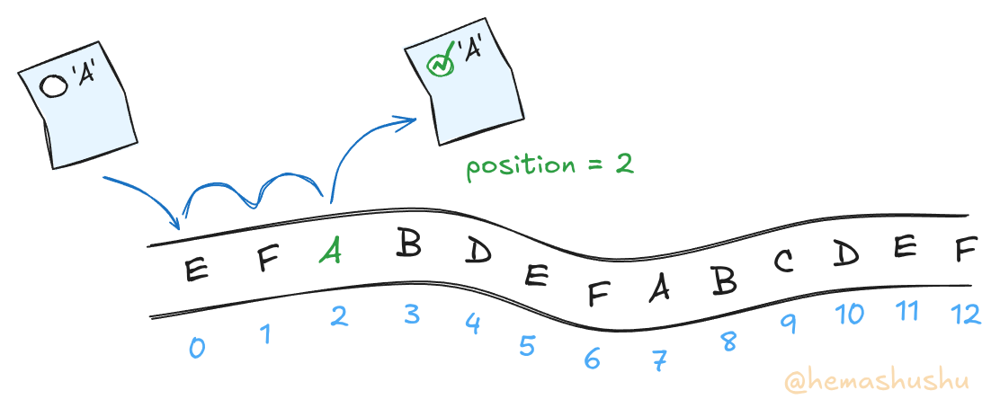
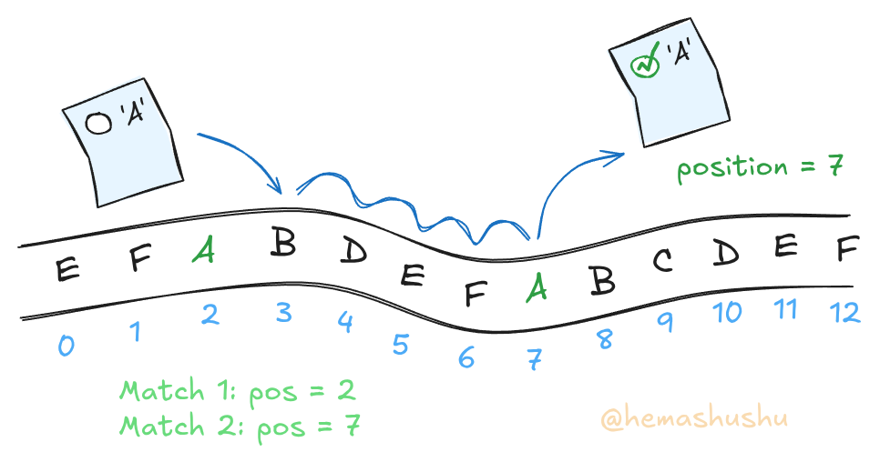
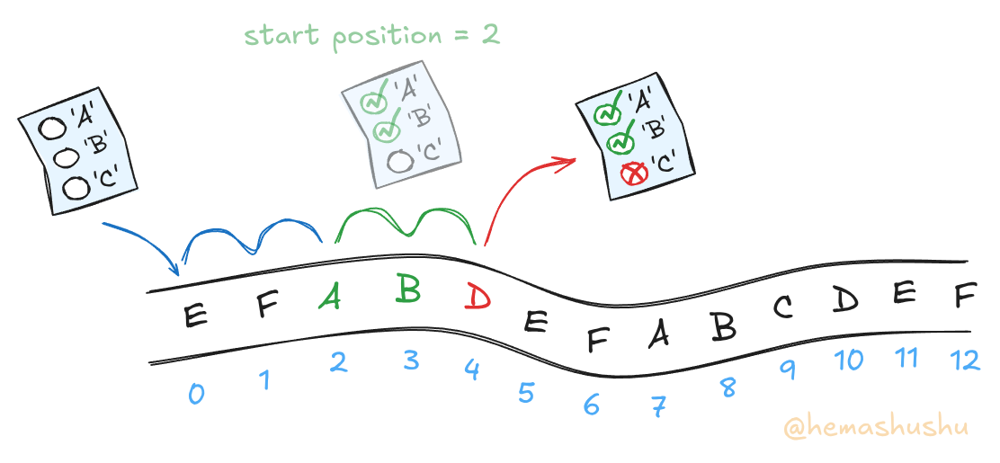
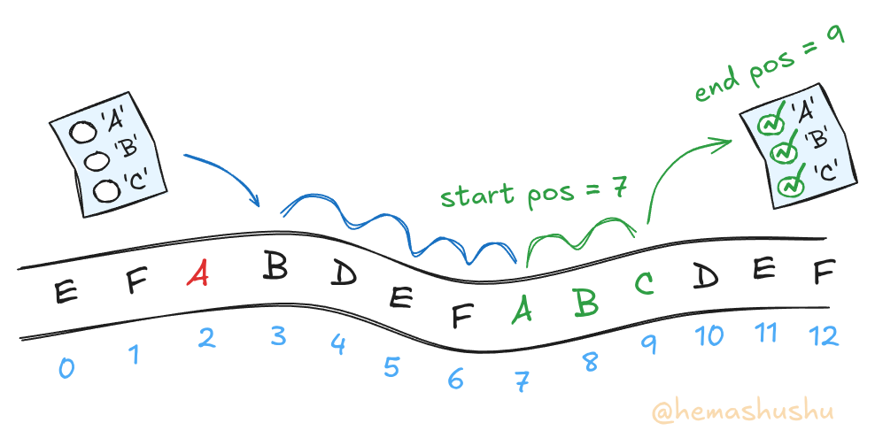
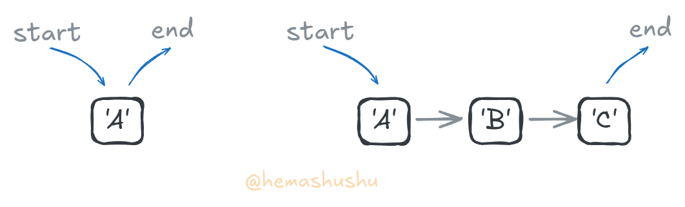
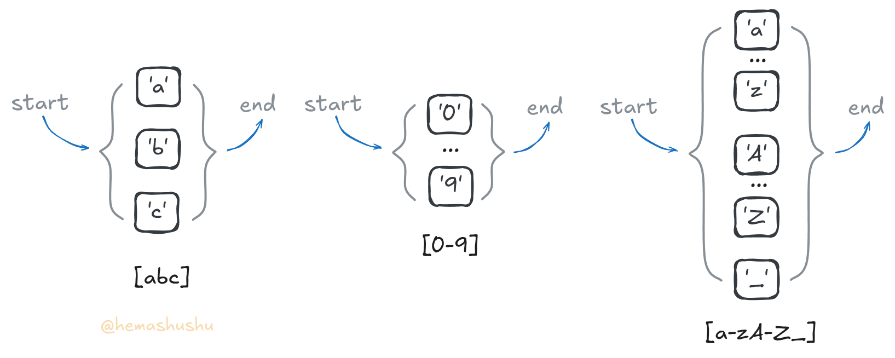

# Regex ANRE


[](https://crates.io/crates/regex-anre) [](https://docs.rs/regex-anre) [](https://github.com/hemashushu/regex-anre)

[Regex-anre](https://github.com/hemashushu/regex-anre) is a lightweight, full-featured regular expression engine that supports both standard and ANRE regular expressions.

Regex-anre provides the same API as [the Rust standard regular expression library](https://docs.rs/regex/), allowing it to be a drop-in replacement for the Rust standard regex library in your project without any code changes.

<!-- @import "[TOC]" {cmd="toc" depthFrom=2 depthTo=4 orderedList=false} -->

<!-- code_chunk_output -->

- [1. Features](#1-features)
- [2. Quick Start](#2-quick-start)
  - [2.1 Find a specific pattern in a string](#21-find-a-specific-pattern-in-a-string)
  - [2.2 Match and capture text](#22-match-and-capture-text)
  - [2.3 Validate a string](#23-validate-a-string)
- [3 Re-recognize the regular expression](#3-re-recognize-the-regular-expression)
  - [3.1 What exactly do regular expressions do?](#31-what-exactly-do-regular-expressions-do)
  - [3.2 The simpliest regular expression - single character](#32-the-simpliest-regular-expression---single-character)
  - [3.3 Strings](#33-strings)
  - [3.4 Route Map](#34-route-map)
  - [3.5 Charset](#35-charset)
- [The ANRE language](#the-anre-language)
- [Difference between Regex-anre and Rust regex](#difference-between-regex-anre-and-rust-regex)

<!-- /code_chunk_output -->

## 1. Features

- **Lightweight**: Regex-anre is built from scratch without any dependencies, making it extremely lightweight. In general, the size of the compiled library is less than 80KB, while the Rust standard regex library (Rust-regex) and its essential dependencies are about 1000KB.

- **Full-featured**: Regex-anre supports most regular expression features, including backreferences, look-ahead, and look-behind assertions, which are not supported in the Rust standard regex library.

- **Hackable**: TODO

- **Maintainable**: Regex-anre is designed to be easy to maintain, with a clean and modular code structure. The code is easy to read and understand, and most importantly, it is well-documented.

- **Reasonable performance**: Regex-anre is not designed for maximum performance but is still reasonably fast. It is about 3 to 5 times slower than Rust-regex in most common cases (such as text validation, finding, and capturing parts of a short string with pre-compiled regex). However, Regex-anre is faster than Rust-regex if the regex object is created dynamically (such as dynamical pattern), thanks to its fast compilation speed.

- **New language support**: ANRE is a functional language designed to be easy to read and write. It can be translated one-to-one into traditional regular expressions and vice versa. They can even be mixed together, eliminating the overhead of writing complex regex expressions.

- **Compatibility**: Regex-anre provides the same API as the Rust-regex library, allowing you to directly replace the Rust standard regex library in your project without any code changes.

## 2. Quick Start

Add the crate [regex_anre](https://crates.io/crates/regex-anre) to your project via the command line:

```bash
cargo add regex_anre
```

Alternatively, you can manually add it to your `Cargo.toml` file:

```toml
[dependencies]
regex_anre = "1.2.0"
```

The following demonstrates the typical use case of regular expressions with Regex-anre.

### 2.1 Find a specific pattern in a string

```rust
// Using traditional regex to find hexadecimal color codes
let re = Regex::new(r"#[\da-fA-F]{6}").unwrap();

// Using ANRE
let re = Regex::from_anre("'#', char_hex.repeat(6)").unwrap();

let text = "The color is #ffbb33 and the background is #bbdd99.";

// Find the first match
if let Some(m) = re.find(text) {
    println!("Found match: {}", m.as_str());
} else {
    println!("No match found");
}

// Find all matches and collect them into a vector
let matches: Vec<_> = re.find_iter(text).collect();
for m in matches {
    println!("Found match: {}", m.as_str());
}
```

### 2.2 Match and capture text

```rust
// Using traditional regex to capture RGB components from hexadecimal color codes
let re =
    Regex::new(r"#(?<red>[\da-fA-F]{2})(?<green>[\da-fA-F]{2})(?<blue>[\da-fA-F]{2})").unwrap();

// Using ANRE
let re = Regex::from_anre(
    r#"
    '#'
    char_hex.repeat(2).name("red")
    char_hex.repeat(2).name("green")
    char_hex.repeat(2).name("blue")
    "#,
    )
    .unwrap();

let text = "The color is #ffbb33 and the background is #bbdd99.";

// Capture groups from the first match
if let Some(m) = re.captures(text) {
    println!("Found match: {}", m.get(0).unwrap().as_str());
    println!("Red: {}", m.name("red").unwrap().as_str());
    println!("Green: {}", m.name("green").unwrap().as_str());
    println!("Blue: {}", m.name("blue").unwrap().as_str());
} else {
    println!("No match found");
}

// Capture groups from all matches and collect them into a vector
let matches: Vec<_> = re.captures_iter(text).collect();
for m in matches {
    println!("Found match: {}", m.get(0).unwrap().as_str());
    println!("Red: {}", m.name("red").unwrap().as_str());
    println!("Green: {}", m.name("green").unwrap().as_str());
    println!("Blue: {}", m.name("blue").unwrap().as_str());
}
```

### 2.3 Validate a string

```rust
// Using a traditional regex to validate a date in the format YYYY-MM-DD
let re = Regex::new(r"^\d{4}-\d{2}-\d{2}$").unwrap();

// Using ANRE
let re = Regex::from_anre(
    "start, char_digit.repeat(4), '-', char_digit.repeat(2), '-', char_digit.repeat(2), end",
)
.unwrap();

println!("{}", re.is_match("2025-04-22")); // Expected: true
println!("{}", re.is_match("04-22")); // Expected: false
```

## Low-level APIs

TODO

## 3 Re-recognize the regular expression

In the general impression of developers, regular expressions are used for validating, searching strings. The regular expression text is somewhat like random characters which are typed by a cat rolling on the keyboard. You may perfer searching regular expressions on the internet, and then copy and paste the myth string into your code. Sometimes these expressions do not work, sometimes they work, but you do not know why.

Regular expressions are hard to master because one is that they are designed concisely and compactly, and the other, the more important one, is that few people tell you how they work, they just tell you the how to use them, it is similar to the teacher only telling you the syntax of C programming language, but not telling you how the program runs in the computer.

In this tutorial, I will explain the principal of regular expression from the engine's view. In detal, I will translate the regular expressions into literals and functions, and showing how they work together. At last, you will find that the regular expression is just a simple language which is combination of literals and functions. In the following sections, I will use the term "ANRE" to refer to this simple language, and use the term "regex" to refer to the traditional regular expression.

### 3.1 What exactly do regular expressions do?

In short, regular expressions are used to match and capture characters (yes, it's not about string, but about characters).

The process is a bit like a robot checking each character in a string one by one, and if the robot finds a character is what it is looking for, it will pick it up and put it in a bag. the robot takes the "wishlist" and keep checking the next character it needed until it finds all the characters on the wishlist.


In the programming world, the "wishlist" is called a "regular expression". The robot is the regular expression engine, and the bag is the memory space where the matched characters are stored. Of course, the engine does not necessarily store the matched characters, but it just store the start and end position of the matched characters for efficiency.

### 3.2 The simpliest regular expression - single character

The simplest regular expression is just a character. For example, the regex `a` will match the character 'a' in a string. The engine will check each character in the string one by one, and if it finds a character that is 'a', it will store the position and end the process.



Some regular expression engines will also provide functions like `find_all` or `match_all` to find all occurrences of the character in the string. The principle is quite simple: the engine just repeats the process of match-and-capture from the position of the last matched.



### 3.3 Strings

Matching single characters is less useful in real-world applications. In most cases, we need to match strings. For example, the regex `abc` will match the string "abc" in a larger string.

In the engine, strings are treated as a sequence of characters. The engine will check each character in the string one by one, if all characters are found the engine will store the start and end position and end the process.

It worth meantion that the engine will discard the matched characters if it finds the next character is not what it is currently looking for. This figure illustrates the engine discarding the matched "ab" when it finds the next character is not 'c'.



Another important thing is: which position the engine should start in the coming process? The engine will start from the position next to the last start position instead of the last end position. In the above example, the engine will start from the position of 'b', which is next to the last start position (i.e. the position of 'a'), instead of position of 'd' or 'e'. This is similar to the simplest String-searching algorithm - the [naive string search](https://en.wikipedia.org/wiki/String-searching_algorithm#Naive_string_search).



Single characters and strings are the simplest regular expressions, in ANRE they are called _Character literals_ and _String literals_. While there is no "String" type in regex, ANRE distinguishes between character literals which surrounded by single quotes and string literals which are surrounded by double quotes.

| Literal Type | Regex | ANRE | Description |
|--------------|-------|------|-------------|
| Char | `a` | `'a'` | Match a single character |
| String | `abc` or `(abc)` | `"abc"` | Match a series of characters in order |

### 3.4 Route Map

We are using a "wishlist" to represent the regular expression in previous examples, which is sufficient for the simple cases. However, the wishlist is not enough for more complex cases, such as the regular expression contained repetition and branches.

It is time for us to upgrade the representation. You might have notice the process of the match-and-capture is a little bit like a trip in some game, where we start from a certain place, and go through a series of checkpoints (each of which have different requirements), and finally arrive at the destination and the trip is complete. We can using a "route map" which consists of a series of nodes (checkpoints) and edges (the path between the nodes) to represent the regular expression, note that every map has a start node and an end node.

This figure illustrates the route maps of regex `a` and `abc`:



Now we can express how a basic engine works using "game rules":

1. There are two cursors, one is the position in the route map which represents the current requirement, and the other is the position in the string which represents the current character. Set both cursors to 0 at beginning.

2. If the current character matches the current requirement, we move both cursors to the next position.

3. If the current character does not match the current requirement, we reset the route map cursor and move the string cursor to the next position of the last start position.

4. If the route map cursor reaches the end node, we have found a match, we store the start and end position of string and end the game with success.

5. If the string cursor reaches the end of the string, we have not found a match, we end the game with failure.

### 3.5 Charset

Let's introduce another literal type - charset. A charset is a set of characters that can be matched. For example, the regex `[abc]` will match any character that is 'a', 'b', or 'c'. For continous characters, we can use the `-` operator to specify a range of characters. For example, the regex `[0-9]` will match any digit from '0' to '9'.

> Regex `[9-0]` is not valid, because the range must follows the order of the characters in the ASCII table (or unicode code points that we will discuss later).

A charset can contains multiple characters and ranges. For example, the regular expression `[a-zA-Z_]` will match any letter (lowercase or uppercase) or underscore.




## The ANRE language

TODO::

## Examples

TODO::

## Difference between Regex-anre and Rust regex

 <!-- (Note: Regex-anre is not optimized for matching very long texts, as it uses Unicode internally, which incurs additional conversion overhead.) -->